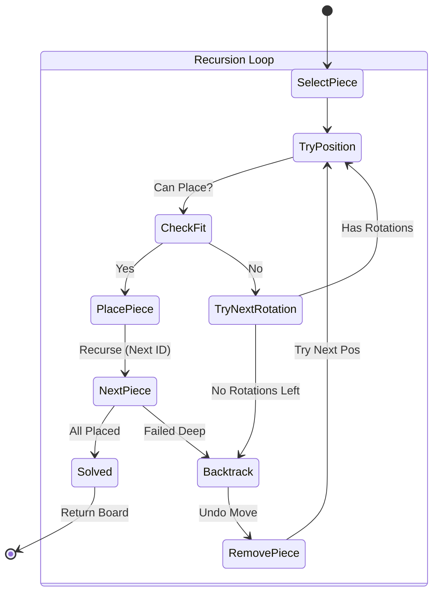
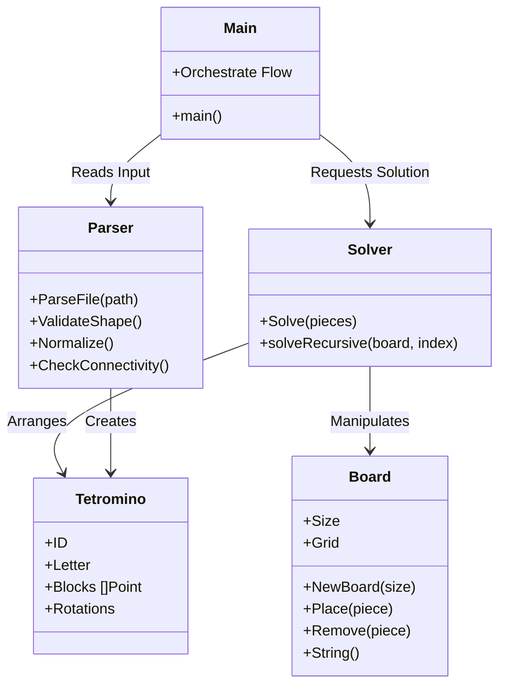

# Tetris Optimizer 🧩

[](https://golang.org/)
[](LICENSE.md)

---

<p align="center">
  🧩 <strong>Tetris Optimizer</strong><br/>
  <em>Optimal tetromino arrangement powered by Go</em>
</p>

<p align="center">
  Backtracking algorithm • File parsing • Smallest square optimization
</p>

---

<p align="center">
  <strong>Arrange tetrominoes into the smallest possible square.</strong><br/>
  <em>Smart. Optimized. Efficient.</em>
</p>

<!-- 🔗 Quick Navigation -->
<p align="center">
  <a href="#-features">Features</a> •
  <a href="#-logic--flow">Logic & Flow</a> •
  <a href="#-technologies-used">Tech Stack</a> •
  <a href="#-getting-started">Getting Started</a> •
  <a href="#-how-to-use">Usage</a>
</p>

---

## Overview

**Tetris Optimizer** is a command-line program written in **Go** that reads tetromino pieces from a text file and arranges them into the smallest possible square using a backtracking algorithm.

Designed as an algorithmic optimization project, Tetris Optimizer demonstrates core concepts such as file parsing, shape rotation, recursive backtracking, and spatial optimization.

---

## ✨ Features

Tetris Optimizer includes the following core features:

- **File Parsing** 📄  
  Reads and validates tetromino pieces from text files. It checks for correct format, 4-line blocks, and valid character usage.

- **Shape Validation** ✅  
  Ensures all pieces are valid tetrominoes:
  - Exactly 4 blocks (`#`).
  - All blocks are connected (validated via DFS/BFS).
  - Proper 4x4 grid spacing.

- **Rotation Logic** 🔄  
  Automatically generates all unique rotations of each piece to maximize fitting potential. It handles symmetry detection to avoid redundant checks.

- **Backtracking Algorithm** 🎯  
  Intelligently places pieces using recursive backtracking. If a piece doesn't fit, it backtracks to the previous piece and tries a new position or rotation.

- **Size Optimization** 📐  
  Finds the **smallest possible square** that fits all pieces. It starts from the theoretical minimum size (`ceil(sqrt(n*4))`) and expands incrementally until a solution is found.

- **Error Handling** ⚠️  
  Prints "ERROR" for invalid input files or malformed tetrominoes, ensuring robust execution.

---

## 🧠 Logic & Flow

The application follows a structured pipeline from parsing to solving. Below are visual representations of the system's logic.

### 1. High-Level Execution Flow

This flowchart illustrates the lifecycle of the program from command-line argument to final output.

```mermaid
graph TD
    A([Start]) --> B{Check Args}
    B -- Invalid --> C[Print Usage Error] --> Z([End])
    B -- Valid --> D[Parse File]

    D --> E{Valid Format?}
    E -- No --> F[Print "ERROR"] --> Z
    E -- Yes --> G[Generate Rotations for All Pieces]

    G --> H[Calculate Min Board Size]
    H --> I[Attempt to Solve (Backtracking)]

    I --> J{Solution Found?}
    J -- Yes --> K[Print Board] --> Z
    J -- No --> L[Increase Board Size] --> I
```

### 2. Backtracking Algorithm (The Core)

The core logical engine uses recursive backtracking to fit pieces. This state diagram shows how the solver decides where to place pieces.



### 3. Application Structure

The code is organized into modular packages to separate concerns.



---

## 🛠️ Technologies Used

- **Go 1.20+** 🐹 – Core language and standard libraries
- **File I/O** 📁 – Reading and parsing tetromino files
- **Algorithms** 🧮 – Backtracking and recursive optimization
- **Data Structures** 📊 – 2D grids and coordinate systems

---

## 🚀 Getting Started

### Prerequisites

- Go version **1.20 or newer**
- A terminal to run the program

### Installation & Setup

1. **Clone the repository:**

   ```bash
   git clone https://learn.reboot01.com/git/sayehusain/tetris-optimizer
   ```

2. **Navigate to the project directory:**

   ```bash
   cd tetris-optimizer
   ```

3. **Install dependencies (if any):**

   ```bash
   go mod tidy
   ```

   _(Note: This project strictly uses the standard library, so no external modules are fetched)_

4. **Build the program:**
   ```bash
   go build -o tetris-optimizer
   ```

---

## 📖 How to Use

Run the program by passing a text file containing tetromino definitions as an argument.

### Basic Usage

```bash
go run . testdata/sample.txt
```

Or using the compiled binary:

```bash
./tetris-optimizer testdata/sample.txt
```

### Input File Format

Each tetromino must be represented as a **4x4 grid** using `#` for blocks and `.` for empty spaces. Consecutive pieces must be separated by **one empty line**.

**Example Input (`sample.txt`):**

```text
...#
...#
...#
...#

....
....
....
####

.###
...#
....
....
```

### Output Example

The program prints the smallest square board with pieces identified by letters (A, B, C...) corresponding to their order in the input file.

```bash
$ ./tetris-optimizer testdata/sample.txt
ABBBB.
ACCCEE
AFFCEE
A.FFGG
HHHDDG
.HDD.G
```

---

## 🏗️ Project Structure

```
tetris-optimizer/
├── main.go              # Entry point: handles CLI args & orchestration
├── packages/            # Modular logic packages
│   ├── parser.go        # Reads file, validates shapes, creates structs
│   ├── tetromino.go     # Tetromino definitions & rotation utilities
│   ├── board.go         # 2D Grid implementation & print methods
│   └── solver.go        # Recursive backtracking algorithm
├── tests/               # Unit tests
└── testdata/            # Sample input files for testing
```

---

## 🤝 Contributing

Contributions are welcome!

1. Fork the repository
2. Create your feature branch (`git checkout -b feature/amazing-feature`)
3. Commit your changes (`git commit -m 'Add some amazing feature'`)
4. Push to the branch (`git push origin feature/amazing-feature`)
5. Open a Pull Request

---

## 📄 License

This project is licensed under the **MIT License**. See [LICENSE.md](LICENSE.md) for details.

---

## 👥 Authors

- **Sayed Ahmed Husain** – [sayedahmed97.sad@gmail.com](mailto:sayedahmed97.sad@gmail.com)
