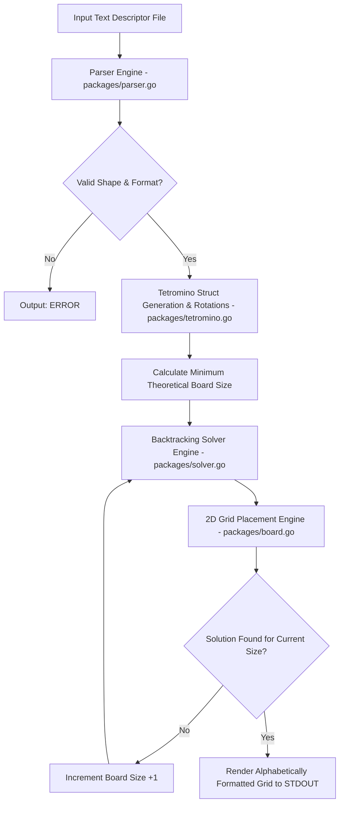
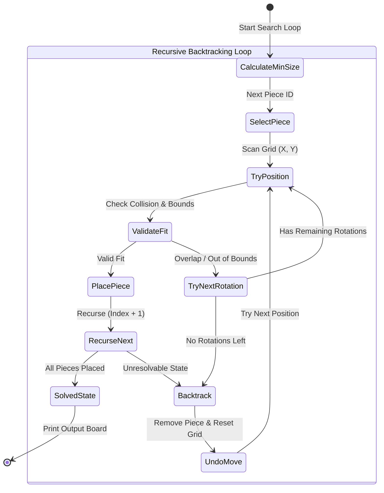

# 🧩 TetraOpt

[](https://go.dev)
[](LICENSE.md)

**TetraOpt** is a high-performance shape packing and backtracking optimization engine written in Go. It ingests arbitrary sets of polyomino / tetromino pieces from formatted text descriptors, validates shape connectivity, generates rotational symmetry variations, and packs them into the smallest possible 2D grid square.

---

## ⚡ Key Highlights

- **File Parser & Connectivity Validator**: Reads 4x4 ASCII grid blocks (`#` and `.`) and validates shape integrity using Depth-First Search (DFS) graph connectivity.
- **Rotational Symmetry Engine**: Generates unique piece rotations while filtering out redundant spatial variations to minimize search space overhead.
- **Recursive Backtracking Solver**: Fits pieces onto an optimal 2D grid matrix, recursively testing coordinates and backtracking when invalid states are hit.
- **Theoretical Minimum Bound Calculator**: Begins board searching at the theoretical lower bound (\(\lceil\sqrt{n \times 4}\rceil\)) and expands size incrementally until a valid square fit is found.
- **Robust Error Protection**: Validates input formatting, line counts, and piece count bounds, returning clean error codes for malformed inputs.

---

## 📋 Table of Contents

- [Key Highlights](#-key-highlights)
- [System Architecture](#-system-architecture)
- [Backtracking Solver Algorithm](#-backtracking-solver-algorithm)
- [Setup & Execution](#-setup--execution)
- [Project Directory Structure](#-project-directory-structure)
- [License](#-license)

---

## 🏗️ System Architecture



---

## 🖥️ Live Terminal Execution Preview

Below is a live terminal trace running TetraOpt on a multi-tetromino input file to pack shapes into the smallest possible 2D grid square:

```text
$ cat testdata/sample.txt
...#
...#
...#
...#

....
....
....
####

.###
...#
....
....

$ ./tetraopt testdata/sample.txt
ABBBB.
ACCCEE
AFFCEE
A.FFGG
HHHDDG
.HDD.G
```

---

## 📐 Backtracking Solver Algorithm



---

## 🚀 Setup & Execution

### Prerequisites

- **Go**: Version 1.20 or newer installed.

---

### Build & Run

1. **Clone Repository**:
   ```bash
   git clone https://github.com/sahmedhusain/tetraopt.git
   cd tetraopt
   ```

2. **Compile Application**:
   ```bash
   go build -o tetraopt .
   ```

3. **Run Optimization Solver**:
   ```bash
   ./tetraopt testdata/sample.txt
   ```

---

### Input & Output Example

#### Input (`testdata/sample.txt`):
```text
...#
...#
...#
...#

....
....
....
####

.###
...#
....
....
```

#### Output:
```bash
$ ./tetraopt testdata/sample.txt
ABBBB.
ACCCEE
AFFCEE
A.FFGG
HHHDDG
.HDD.G
```

---

## 📂 Project Directory Structure

```
tetraopt/
├── main.go              # CLI bootstrapper & argument parser
├── go.mod               # Go module manifest (module tetraopt)
├── README.md            # Documentation
├── test.sh              # Verification test script
├── packages/            # Core optimization packages
│   ├── parser.go        # Text file lexer, format validator, & DFS connectivity checker
│   ├── tetromino.go     # Tetromino struct definitions & rotational variations
│   ├── board.go         # 2D Grid allocation, placement, and ASCII renderer
│   └── solver.go        # Recursive backtracking solver algorithm
├── tests/               # Unit test files
└── testdata/            # Sample input test files
```

---

## 📄 License

Distributed under the MIT License. See [LICENSE](LICENSE.md) for details.
